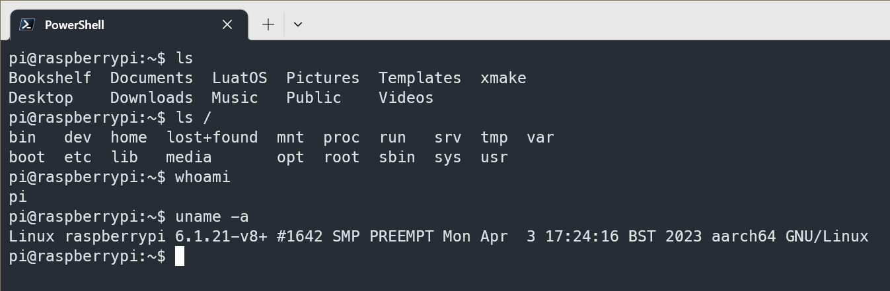
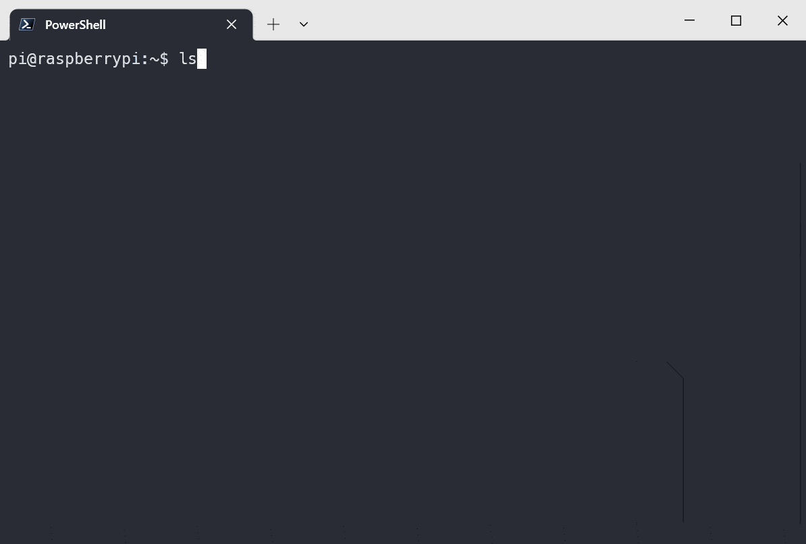

# serialport_monitor

用自己喜欢的终端打印串口日志。pure serialport data printer, for your favorite terminal.

可以代替MobaXterm、SecureCRT、PuTTy等串口连接SSH或查看日志的软件。





我是搭配window terminal用，挺好

已上传win的编译文件到release，可以自取

## Install

```bash
cargo install serialport_monitor
```
